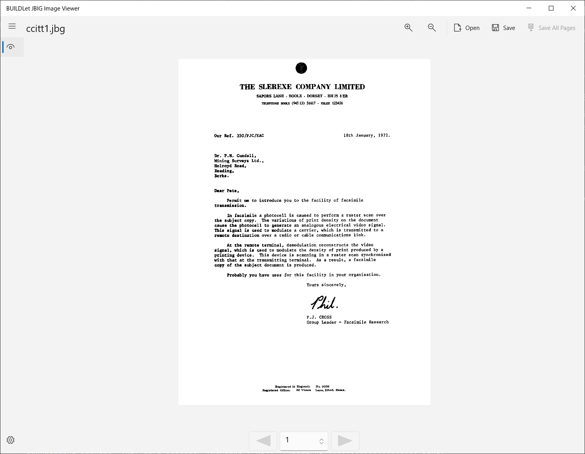

BUILDLet JBIG Image Viewer
==========================

Introduction
------------

This project provides the UWP (*Universal Windows Platform*) viewer app especially for **JBIG** (*Joint Bi-level Image experts Group*) image.

Getting Started
---------------

1. Download the certification file [BUILDLet.cer](./Certificate/BUILDLet.cer) to your computer.
2. Import the downloaded certification file (*BUILDLet.cer*) into your *Trusted Root Certification Authorities* of *Local Machine*, if you can trust us.
3. Download the installer package for your platform ([x86](./BUILDLet.JbigImageViewerAppPackage/AppPackages/BUILDLet.JbigImageViewerAppPackage_1.1.1.0_x86_Test/BUILDLet.JbigImageViewerAppPackage_1.1.1.0_x86.msix), [x64](./BUILDLet.JbigImageViewerAppPackage/AppPackages/BUILDLet.JbigImageViewerAppPackage_1.1.1.0_x64_Test/BUILDLet.JbigImageViewerAppPackage_1.1.1.0_x64.msix), [ARM](./BUILDLet.JbigImageViewerAppPackage/AppPackages/BUILDLet.JbigImageViewerAppPackage_1.1.1.0_ARM_Test/BUILDLet.JbigImageViewerAppPackage_1.1.1.0_ARM.msix) or [ARM64](./BUILDLet.JbigImageViewerAppPackage/AppPackages/BUILDLet.JbigImageViewerAppPackage_1.1.1.0_ARM64_Test/BUILDLet.JbigImageViewerAppPackage_1.1.1.0_ARM64.msix)) on your computer, and execute it.

Trouble Shooting
----------------

- **Phenomenon:**
  If our certification file ([BUILDLet.cer](./Certificate/BUILDLet.cer)) has not correctly imported into your *Trusted Root Certification Authorities* of *Local Machine*, the "**Install**" button of the installer package (*msix*) is not enabled.

- **Solution:**
  Download our certification file [BUILDLet.cer](./Certificate/BUILDLet.cer) to your computer, and Import it to your *Trusted Root Certification Authorities* of *Local Machine* if you can trust us, before you launch the installer package.

Build and Test
--------------

- This project (*Visual Studio Solution*) is built and tested on Visual Studio.
- We did not tested our App on *ARM* Platform (including *ARM64*).

Change History
--------------

- **v1.0.0** (August 9, 2021)
  - 1st Release

- **v1.1.1** (September 15th, 2021)
  - Feature to save image(s) as bitmap file(s) was supported.
  - Advanced feature for JBIG image as the following was supported.
    - Remove unnecessary PJL command line in the file.
    - Divide into multiple pages when the number of PJL command line exceeds than threshold.

License
-------

This project is licensed under the [MIT](https://opensource.org/licenses/MIT) License.

Also, this project is cantaining **[BUILDLet.Imaging.Jbig](https://github.com/buildlet/BUILDLet.Imaging.Jbig)**, which is including **[JBIT-KIT](https://www.cl.cam.ac.uk/~mgk25/jbigkit/)** (*jbig1.dll*) and **[NetPbm for Windows](http://gnuwin32.sourceforge.net/packages/netpbm.htm)** (*jbigtopnm.exe*, *ppmtobmp.exe* and *libnetpbm10.dll*).
Regarding **JBIG-KIT** and **NetPbm for Windows**, please refer to *README* of **BUILDLet.Imaging.Jbig**.
